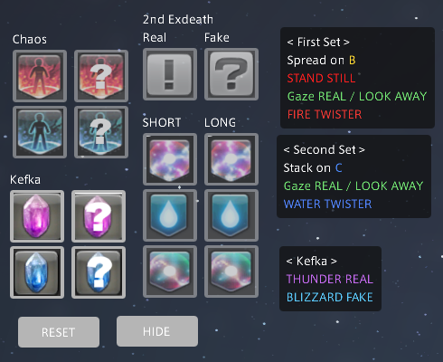

## This does NOT read/parse any sort of combat data nor automates any combat for you
I've been seeing a lot of discussion of this plugin and a lot of people are either not understanding what this plugin actually does or are making unfair comparisons of it to automated tools like splatoon and cactbot.

This does not achieve anything that can't already be achieved by in-game macros and solo linkshell chat windows, or pressing in-game macros at specific points in time. Everything from the announcement feature, to the self-marking for spreads, to the text chat and color-coded text can all be achieved with in-game macros and chat windows. 

1. The self-marking is issued through a self mark / macro command (the same you would use for in game macro) and is only issued when you press a button and only done so for your spread (exactly the same as an ingame macro) this does not read combat data to make that determination or perform any action automatically.
2. The announcement feature is just a more organized approach to /p commands that you could setup in in-game macros (exactly the same as an ingame macro) this does not read combat data to make a determination on when to perform the announcement nor does it automatically know what kind of announcement should be sent, and the announcement is not done automatically without user input.
3. The text organization and color coded text can be achieved by just pressing in-game macros at specific times and setting up solo linkshells + changing their text color (this is the only portion that is more advanced than in-game in terms of its customizability and UI flexibility, however, you can achieve almost the entirety of its functionality through in-game means).
4. This does not read or parse any combat data, and does not automatically perform any actions that aren't strictly defined by a macro and performed by manual button press. This does not automate resolution of the mechanic in anyway and the actions it performs are 1-to-1 in core functionality to that of in-game macros.

You can criticize this plugin from the standpoint of it being a better UI, customization/organization of text, or that it has features to help reduce bloat of UI on screen, but to say that it's anything compared to cactbot is an unfair comparison and I urge you to try out the plugin or read the source code yourself to understand that this isn't doing any of those things.

This ultimately is no different from using a tool like wtfdig.info's browser-based p4-helper, using in-game macros, or relying on another's manually inputed call-outs to resolve the mechanic. It's hard for me to justify that those are okay to use, but this plugin isn't, when they effectively achieve the same outcome through effectively the same means. 

## Planned Updates

1. Alternative mode: Combination macros. Cuts number of macros in half by doing "combination" button presses. Further cuts down buttons
2. Alternative mode; Simple macros. Cuts numbers of macros down the simplest number needed.

# Snazzy P4

A robust custom macro system for the Kefka UMAD/DMU Phase 4 mechanics. You tap the
buttons for what you see in the fight, and the plugin turns them into short, readable
callouts (spread/stack targets, gaze, chaos and Kefka) so you can cut the macro bloat.



## Preface

I made this plugin ultimately to cut down on macro bloat and make it easier to read/parse macro text. As well as creating
a solution for the community that would persuade them to avoid ever adopting Auto-Markers for this phase.

What Snazzy P4 does ***NOT*** do:
1. Does not parse combat data.
2. Does not read your debuffs.
3. Does not resolve any mechanic for you.
4. Does not place markers on you automatically by reading combat data like AM (it only places a marker on you when pressing a macro similar to a /mk <me> command in an in-game macro, based purely on the text command you define for the said macro)
5. Does not announce anything to chat automatically by reading combat data like cactbot (it only sends chats when you press a macro similar to a /p command in an in-game macro, based purely on the chat command you define for the said macro).
6. Does not make any sort of determination or automated action without direct user input that is directly controlled via macro press and that can't be 1-to-1 replicated by an in-game macro.

The only game state it ever reads is optional and non-combat: the **Automation** settings can
check which duty you're in and whether the party wiped, purely to auto open/close/reset the
overlay. Nothing about the fight itself is read or resolved for you. These are all off by default. These Automation settings do not affect combat in anyway nor do they read combat data beyond determining when the party has wiped for the direct purpose of hiding/resetting the UI.

This means you must still:
1. Read your debuffs and understand what they do.
2. Press macros appropriately.
3. Know whether you are the Gaze shooter.
4. Resolve Anti-Light by looking at debuffs.
5. Resolve the Thunder/Blizzard Fake/Real Math.
6. Know how the mechanic works, when things occur, and where to go.

I did not make this plugin to do everything for you or automate combat in any way, which is why it does not include the things I've listed above.
If you desire those things - use cactbot. I will not be updating this plugin to do any of those things.

## Overview

You hate macro slop - so do I. 

Snazzy P4 is designed to be a replacement for the in-game macros, reducing macro bloat
and making macro resolution text more readable and easier to parse.

You press a few buttons as the mechanics happen and it lays out clean, colour-coded text telling you
what to do. Everything is repositionable, rescalable and recolourable, and it can run
as one window or as separate floating panels.

- **Exdeath** — Real (`!`) or Fake (`?`) macros for Exdeath tell, 
                Short/Long debuff (Lightning / Drop / Acceleration) macros, 
				and respective Resolution text.
- **Chaos** — Inferno / Tsunami macros and resolution text.
- **Kefka** — Thunder / Blizzard buttons macros and resolution text.
- **Organized Sets** — Separate First/Second set text windows that organize the resolution text in chronological order
                       in which they will occur (or optionally combined into one panel, stacked or side by side).
					   This includes the following (In this exact order):
					       1. Spread / Stack
                           2. Move / Stand Still
                           3. Gaze
                           4. Twister / Donut
- **Chat Callouts** — Optional announcements sent to a chat channel of your choice (party,
                      linkshell, free company, echo for testing, and more). **Party Mode**
                      (default) sends the mechanic callouts - debuff resolutions with target
                      letters, gaze, chaos and Kefka; an advanced **Personal Mode** adds
                      title/custom callouts and per-announcement channels.
- **Self Marked Spreads** — Optional Self marking for spread markers based on role.

## Installation

Snazzy P4 is distributed through my personal Dalamud plugin repository.

1. In-game, open the Dalamud settings with `/xlsettings`.
2. Go to the **Experimental** tab.
3. Under **Custom Plugin Repositories**, paste this URL into an empty row and press the **+** button:

   ```
   https://raw.githubusercontent.com/snazzysosnazzy/SnazzyP4/main/pluginmaster.json
   ```

4. Press **Save and Close**.
5. Open the plugin installer with `/xlplugins`, search for **Snazzy P4**, and install it.
6. Open the plugin with `/snazzyp4`.

## How to Use

1. Open by typing the command `/snazzyp4`
2. Access Settings using either the **Settings** button on the Toolbar, or typing the command `/snazzyp4 config`.
3. Select your **Role** in **Settings** — Support or DPS.
4. As the fight plays out, press the buttons for what happens:
   - Press **Real (`!`)** or **Fake (`?`)** for the **1st Exdeath** tell, then the **Short/Long**
     button matching your debuff for that set. Repeat for the **2nd Exdeath**.
   - Press the **Chaos** button (Inferno/Tsunami) that goes off.
   - Press the **Kefka** button (Thunder/Blizzard) that goes off.
5. Read the **First Set** / **Second Set** / **Kefka** panels for the resolution.
6. Made a misclick? Press **Undo** to step back the last button press (one at a time).
7. Press **RESET** between pulls to clear everything.

That's it — the buttons grey out when they no longer apply, so you can't mis-enter.

### Moving things around

- **Edit Layout** (toolbar or settings): the buttons lock and every panel fills with
  sample text; click-and-drag any panel to reposition it. Turn it off when done.
- **Detached** mode makes each panel its own window. **Move All** (detached only) drags
  every window together.

## Controller Players

Controller players can't click the panel buttons, so every button also has a slash command
that does the exact same thing. Put each one into its own in-game macro and bind it.

**Recommended:** since you won't be clicking anything, turn on **Hide macro buttons** in
**Settings → Controller Settings**. It removes the Exdeath / Chaos / Kefka / Reset / Hide
button panels from the normal UI and keeps only the **First Set**, **Second Set** and
**Kefka** resolution text on screen. That same section also has a **Copy** button for every
command below.

```
/snazzyp4 ExDeathReal        /snazzyp4 ExDeathFake
/snazzyp4 LightningShort     /snazzyp4 LightningLong
/snazzyp4 DropShort          /snazzyp4 DropLong
/snazzyp4 AccelerationShort  /snazzyp4 AccelerationLong
/snazzyp4 InfernoReal        /snazzyp4 InfernoFake
/snazzyp4 TsunamiReal        /snazzyp4 TsunamiFake
/snazzyp4 ThunderReal        /snazzyp4 ThunderFake
/snazzyp4 BlizzardReal       /snazzyp4 BlizzardFake
/snazzyp4 Reset              /snazzyp4 Hide
/snazzyp4 Undo
```

The commands respect the same rules as the buttons — a pick that isn't valid yet (for example
a short/long before its Exdeath) is simply ignored, exactly like a greyed-out button.

## Configuration Settings

Open with the **Settings** button or `/snazzyp4 config`. Settings are grouped into tabs.

### General

- **Never show version update messages** — gold toggle; stops the changelog popup after each update.
- **Role** — Support or DPS.
- **Apply Marker on Macro Press** — pressing the spread macro also runs the `/mk` self-mark for
  that set, with a choice of head marker per role and set (attack / bind / ignore / shapes).
  Always placed on yourself, only when you press the button — the same as an in-game macro.
- **Automation** — all off by default:
  - **Auto Open/Close on Enter/Exit of Duty** — opens the overlay when you enter a captured
    instance and closes it when you leave. Click **Use current instance** while inside Dancing Mad
    to set the trigger.
  - **Reset on Hide Button Press** — runs Reset whenever you press Hide.
  - **Reset on Wipe** / **Hide on Wipe** — run Reset / Hide when the party wipes (uses the game's
    duty state).
- **General Settings** — show toolbar (it collapses when you press Hide, expands on Show, and
  its `<<`/`>>` arrows work any time), **Hide Toolbar when UI is hidden**,
  **Persistent Toolbar Collapsed State** (Hide/Show leave the collapsed state alone),
  **Hide all name labels** (off by default) and **Hide all title bars** (on by default) — while
  a global switch is on, the per-section switches in the Layout tab are disabled — detached
  windows, edit layout, Move All; floating
  **Hide** / **Reset** / **Undo** buttons; **Hide Resolved Buttons Until Reset** (each button
  group disappears once fully entered and returns on Reset); **Acceleration on the same line**
  as Spread/Stack (`Spread on X and MOVE`); **combine the First and Second sets** into one panel
  (stacked or side by side, with a pinnable divider); **bring all windows on-screen**.
- **Settings profiles** — copy your whole setup to the clipboard, or paste one in.
- **Reset** — **Reset layout to defaults** / **Restore ALL settings to defaults**.

### Chat

- **Enable chat announcements** — master switch, off by default; nothing is sent while it's off.
- **Mode** (mutually exclusive):
  - **Party Mode** (default) — sends the mechanic callouts: debuff resolutions with **both
    roles' target letters** (e.g. `[1st] Lightning - Spread on D/B`), gaze, Inferno/Tsunami and
    the Kefka Thunder/Blizzard callouts.
  - **Personal Mode** (advanced, hidden until you reveal it) — adds titles and custom callouts
    (kept out of `/p` party chat unless you flip the override), shows only **your own role's
    letter** on messages that don't go to `/p`, and can route each announcement to its own
    channel.
- **Chronological summary** — hold the per-press announcements back and instead send the whole
  list, in fight order, once everything is pressed.
- **Include [1st] / [2nd] prefix** in the default messages.
- **Channel** — pick the active channel (Party, Say, Linkshells, Echo for testing, and more),
  **Copy settings to...** another channel, and **Quick toggles** to turn all announcements (or just
  the set titles) on/off for that channel.
- **Announce Exdeath** (fires on an Exdeath Real/Fake press), **Announce Chaos** (fires on a
  chaos press) and **Announce Kefka** (fires on a Thunder/Blizzard press; always per press,
  never part of the chronological summary) — each split by set/mechanic and Real/Fake, and each
  branch uses:
  - **Ordered list** — reorderable per-mechanic toggles with custom, reorderable message lists, an
    optional **Announce Title** line, and a **+ Add custom message** button.
  - **Simple text box** — one chat line per message.

### Layout

- **Global Layout Settings** — three collapsible groups:
  - **Scaling** — **Global UI Scale** (multiplies everything), **Toolbar Scale**, **Button UI
    Scale** and **Text Panel UI Scale**, each with percentage presets.
  - **Opacity** — global **Background**, **Toolbar**, **Button** and **Text** opacity
    multipliers; each section's own opacity below multiplies on top.
  - **Position** — **Move All UI** X/Y sliders (shift everything together; Move All drags update
    them live), **Toolbar** position sliders, and group sliders for the **Button Panels** and
    **Text Panels**.
- **Sections** — fine-tune per section: position, scale, background opacity, hide title bar /
  labels, and button or text opacity for the current mode (windowed and detached keep separate
  values).

### Colors

- One-click **colourblind palette presets** (Deuteranopia / Protanopia / Tritanopia) as starting
  points.
- Then **recolour every element** individually to fine-tune.

### Text

- Rename any panel label, section header, resolution callout (spread/stack, gaze, acceleration,
  chaos, Thunder/Blizzard), the **A/B/C/D target letters**, or any button.
- Leave a field blank to keep its default.

### Controller

- Hide the macro buttons and copy the per-button slash commands (see
  [Controller Players](#controller-players)).

### Hidden

- The unlock field for the optional Last Fake resolver (see below).

By default Snazzy P4 runs in **detached** mode — each panel is its own floating window — at a
compact scale. Use **Edit Layout** (drag any panel) or the **Layout** tab to arrange them, and
**Bring all windows on-screen** (General tab) if anything ends up off-screen.

## Hidden Settings

I previously mentioned that this plugin does not Resolve the Thunder/Blizzard Fake/Real Math.

However, after a lot of requests, I have added this feature as a hidden setting that you must unlock for it to be available.
I would much prefer no one to use this setting and for you to resolve it manually as intended, as this feature does not align with
the original goals of this plugin. This plugin was designed to ultimately reduce macro bloat and macro resolvement text to be more readable.
I never wanted this plugin to resolve anything automatically for you and I have tried my best to stay true to that.

In other words: I'd rather you didn't. It's there if you truly need it, but the plugin
is meant to *reduce* what you have to think about, not resolve the fight for you.

But I get it, this phase is hard. So if you REALLY require this then by all means do what you have to do; I am not going to tell you how to play the game.
I hope you can decide to respect my wishes and to not enable this setting. I do not believe anyone actually needs it, and I think you are doing a disservice
to yourself as a raider by choosing to use it. If you still do not care about any of this - go ahead and access the setting.

This hidden option, is unlocked through the `...` field at the bottom of settings, that turns the Kefka **Last Fake?** resolution buttons on. 
Type "i_need_it" inside of the text box and hit `Confirm`. A final message will appear to double confirm that you want to use the feature.
Hit `Confirm` at the bottom of the message if you still want it to be enabled.

**How it works:** this *does* resolve the Thunder/Blizzard fake/real for you — but only
from your button input, never by reading combat data. It adds a small **Last Fake?** toggle
button next to each of the Thunder and Blizzard resolution lines in the Kefka panel, for the
last set. You press the button to mark whether that line is the fake, and the resolution
text flips between **REAL** and **FAKE** accordingly. Nothing happens on its own — it only
updates when *you* press a button, so it still requires your input; it just does the flip
for you instead of you doing it in your head.

**Appearance:** once unlocked, the Hidden tab gains a **Last Fake toggles** section where you
can show the toggles as plain checkboxes or as custom REAL/FAKE buttons (with your own text,
size and opacity), and optionally pull them out into their own detached panel(s).

**Announce Last Fake:** the same section can add an **ANNOUNCE** button (floating, or dockable
to any side of the Kefka panel — top, bottom, left or right) that posts the current Kefka
values to a chat channel. Put `{KefkaThunder}`
and `{KefkaBlizzard}` in your message and they are replaced with the current value (REAL/FAKE,
both customisable; `?` if that mechanic hasn't been pressed).

**Controller commands:** once this feature is unlocked, the Last Fake toggles also get slash
commands (with Copy buttons in Settings → Controller Settings), so controller players can
flip them from macros just like the other buttons:

```
/snazzyp4 LastThunderReal    /snazzyp4 LastThunderFake
/snazzyp4 LastBlizzardReal   /snazzyp4 LastBlizzardFake
```

## Support

If Snazzy P4 makes your P4 pulls a little less painful and you want to support development, you can buy me a coffee:

[](https://ko-fi.com/snazzysosnazzy)

---

*made by snazz*
